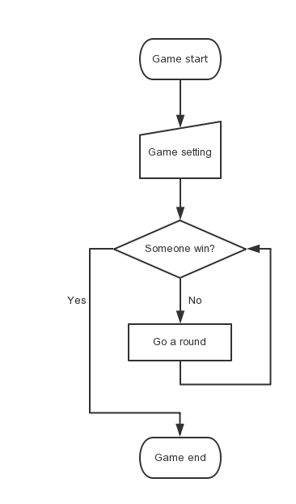
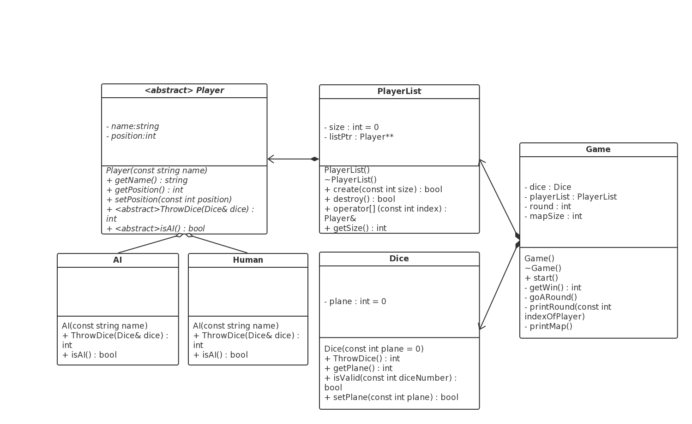
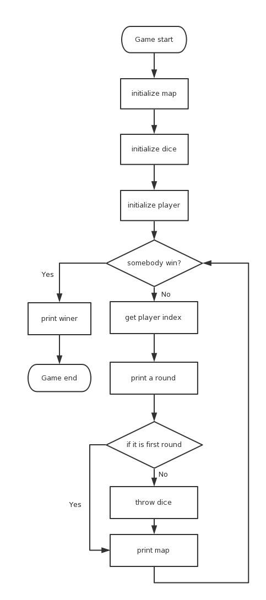

#中山大学移动信息工程学院本科生实验报告

###（2015学年春季学期）

######课程名称：软件设计（II）             任课教师：饶洋辉

###1.实验题目

- **1000. Project A - Dice Game**
使用OOP设计Dice Game，并在原有基础上扩展其功能。

###2.实验目的

- 利用面向对象设计程序，运用类，函数重载，多态，继承等一系列OOP特性，设计具有封装性，可扩展性的程序。

###3.程序设计

- 游戏过程分析

- 系统模块设计

1. `Player`抽象类管理每个玩家的数据，并派生出`AI`类和`Human`类，分别对应计算机控制的角色和用户控制的角色。`Player`类成员变量记录实例的名字和位置。
2. `PlayerList`类为多人游戏提供支持，提供访问管理多个`Player`实例的接口。
3. `Dice`类允许用户创建一个多面骰子实例，在随机抛投的时候，不使用时间作为种子，防止短时间内抛投返回值相同，每次抛投使用上一次结果作为种子，迭代进行，保证结果随机化。
4. `Game`类允许创建Dice Game的实例，构造之后会自动创建一个`Dice`和`PlayerList`实例供`Game`实例内部调用。
	
- 游戏具体流程
