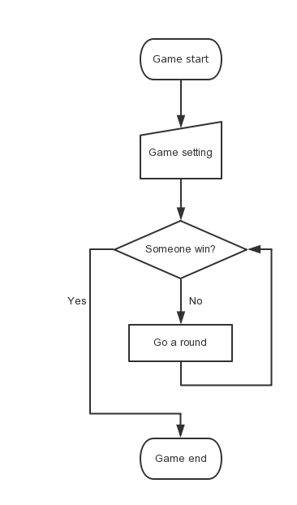
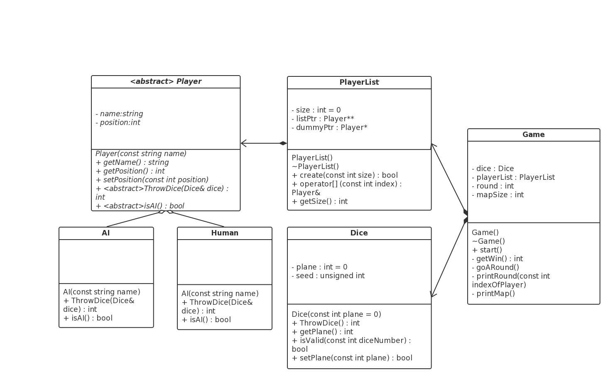
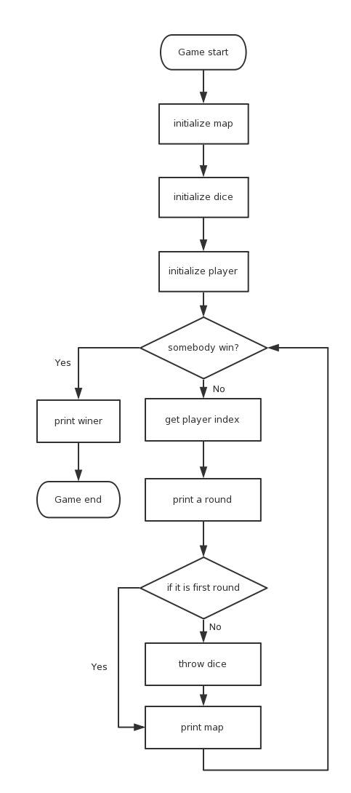
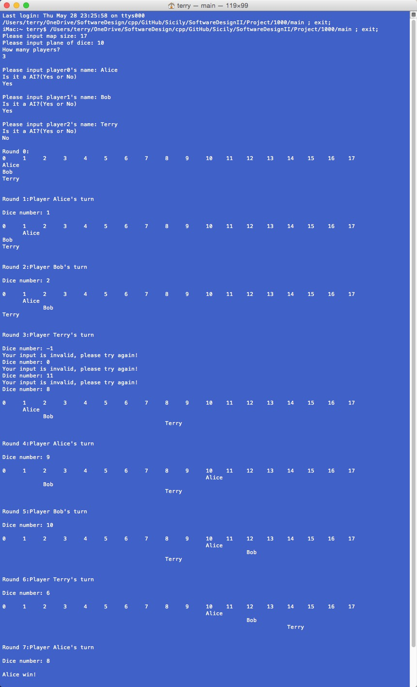

#中山大学移动信息工程学院本科生实验报告

###（2015学年春季学期）

######课程名称：软件设计（II）             任课教师：饶洋辉
| 年级      |   14级    | 专业（方向）  |  移动信息工程  |
| :-------- | --------: | :-------------|-------------- :|
| 学号      |14353026   |  姓名         | 陈启聪         |
|电话       |13632278888| Email         |terry@32ph.com  |
|开始日期   |2015.05.01 | 完成日期      |  2015.05.28    |

###1.实验题目

- **1000. Project A - Dice Game**
使用OOP设计Dice Game，并在原有基础上扩展其功能。

###2.实验目的

- 利用面向对象设计程序，运用类，函数重载，多态，继承等一系列OOP特性，设计具有封装性，可扩展性的程序。

###3.程序设计

- 游戏过程分析

- 系统模块设计

1. `Player`抽象类管理每个玩家的数据，并派生出`AI`类和`Human`类，分别对应计算机控制的角色和用户控制的角色。`Player`类成员变量记录实例的名字和位置。
2. `PlayerList`类为多人游戏提供支持，提供访问管理多个`Player`实例的接口。
3. `Dice`类允许用户创建一个多面骰子实例，在随机抛投的时候，不使用时间作为种子，防止短时间内抛投返回值相同，每次抛投使用上一次结果作为种子，迭代进行，保证结果随机化。
4. `Game`类允许创建Dice Game的实例，构造之后会自动创建一个`Dice`和`PlayerList`实例供`Game`实例内部调用。
	
- 游戏具体流程

###4.程序运行与测试

###5.实验总结与心得
- 学会了top-down的设计思想，分解问题，分析需求，设计适合的系统解决问题。
- 学会了面向对象设计程序，学会了使用类的继承，提高了代码的重复利用性，体会类的封装性。
- 设计`Player`类及其派生`AI`类和`Human`类时，使用了虚函数，理解动态绑定与静态绑定的区别，理解多态含义。
- 学会了抽象类的设计，设计`PlayerList`时，理解了接口的概念。
- 学会了new和delete的配套使用，防止内存泄漏。
- 练习了使用函数重载，运算符重载，提高程序的可读性。

###6.提交文件清单
1. main.cpp
2. Game.h
3. Dice.h
4. PlayerList.h
5. Player.h